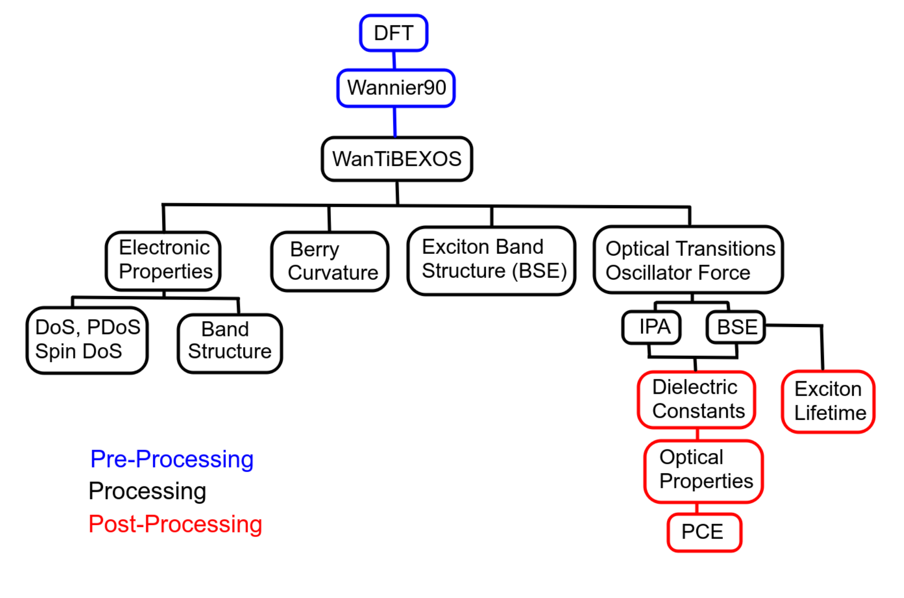

.. WanTiBEXOS documentation master file, created by
   sphinx-quickstart on Fri Dez  30 20:20:25 2022.
   You can adapt this file completely to your liking, but it should at least
   contain the root `toctree` directive.

Welcome to WanTiBEXOS's documentation!
=======================================

Looking for a computational tool to study the electronic band structures, optical properties, and 
topological characteristics of 0D, 1D, 2D, and 3D materials? Look no further than **WanTiBEXOS** code! Written 
in Fortran90 and parallelized with OpenMP, this tool was developed using the Tight-Binding Hamiltonian 
created by Wannier90 code and boasts various features. So if you're interested in studying excitonic 
phenomena and more, give **WanTiBEXOS** a try.

The basics of WanTiBEXOS consist of the following stages:
^^^^^^^^^^^^^^^^^^^^^^^^^^^^^^^^^^^^^^^^^^^^^^^^^^^^^^^^^^^^^
   #. Pre-processing, which involves performing DFT and Wannier90 calculations to generate MLWF-TB parameters.
   
   #. Processing, in which **WanTiBEXOS** simulations are run.
   
   #. Post-processing, during which various physical properties are calculated based on data generated in the first two stages.

This documentation shows how to apply the **WanTiBEXOS** functions to perform electronic and optical properties simulations 
for any periodic material. Here's a list of what **WanTiBEXOS** can do for you:

   * Band structure
   * DoS, Spin-DoS and Projected DoS
   * Berry Curvature (non-metallic systems only)
   * Several options of Coulomb potentials designed for 3D, 2D, and 0D systems
   * BSE solver using TDA approximation
   * Exciton band structure
   * Exciton wavefunctions
   * Exciton Radiative lifetimes
   * Dielectric function and optical properties, with and without excitonic effects.

.. toctree::
   :maxdepth: 1
   :caption:  Installation & Inputs

   installation/install
   installation/inputs

.. toctree::
   :maxdepth: 1
   :caption: Formalism

   theoretical_background/formalism.rst

.. toctree::
   :maxdepth: 1
   :caption: Development

   references/license/index
   references/citing/index
   references/dev_team/index

.. |date| date:: %b %d, %Y

This document was generated |date|.